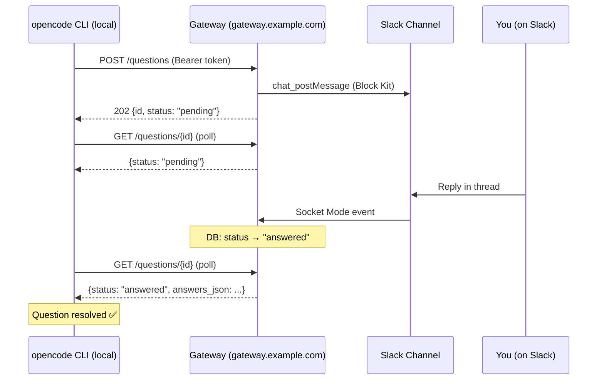

The Slack Question Gateway is a standalone Python microservice that bridges opencode's interactive CLI question system with Slack. The local opencode CLI pushes questions TO the gateway (running on a remote server with a public domain), the gateway posts to Slack, captures your reply via Socket Mode, and sends the answer back to the CLI. All communication is authenticated and encrypted.

## How It Works

The gateway runs on a remote server with a public domain name (e.g., `gateway.example.com`). The CLI pushes questions to the gateway, which posts them to Slack as Block Kit messages. When you reply in the thread, Slack delivers the event via Socket Mode (outbound WebSocket) — no public inbound port is required FOR SLACK. Port 8080 must be reachable from the CLI's machine for the polling endpoint.



## Prerequisites

<CardGroup cols={2}>

<Card icon="python" title="Python 3.12+">
  Required to run the gateway. Download from [python.org](https://www.python.org)
</Card>

<Card icon="docker" title="Docker">
  Recommended for server deployment. Install from [docker.com](https://www.docker.com)
</Card>

<Card icon="slack" title="Slack Workspace">
  You need permission to create a Slack app with Socket Mode enabled
</Card>

<Card icon="globe" title="Public Domain Name">
  Gateway must be reachable as `https://gateway.example.com` from the CLI's machine (or the internet)
</Card>

</CardGroup>

## Quick Start

<Tabs>

<Tab title="Docker Compose">

```bash
# Navigate to the gateway directory
cd slack-app-data-capture

# Copy the template
cp .env.example .env

# Edit .env with your Slack tokens and API key:
# SLACK_BOT_TOKEN=xoxb-...
# SLACK_APP_TOKEN=xapp-...
# SLACK_CHANNEL=#opencode-questions
# API_KEY=$(openssl rand -hex 32)

# Start the gateway
docker compose up -d
```

</Tab>

<Tab title="Docker (manual)">

```bash
# Generate a strong API key
API_KEY=$(openssl rand -hex 32)

# Build the image
docker build -t slack-gateway slack-app-data-capture

# Run the container
docker run -d \
  --name gateway \
  -p 8080:8080 \
  -v gateway_data:/app/data \
  -e API_KEY=$API_KEY \
  -e SLACK_BOT_TOKEN=xoxb-... \
  -e SLACK_APP_TOKEN=xapp-... \
  -e SLACK_CHANNEL=#opencode-questions \
  slack-gateway
```

</Tab>

<Tab title="Python">

```bash
# Create virtual environment
cd slack-app-data-capture
python3.12 -m venv .venv
source .venv/bin/activate

# Install dependencies
pip install -r requirements.txt

# Create .env file
cp .env.example .env

# Edit .env with your credentials
# API_KEY=$(openssl rand -hex 32)
# SLACK_BOT_TOKEN=xoxb-...
# SLACK_APP_TOKEN=xapp-...
# SLACK_CHANNEL=#opencode-questions

# Run the gateway
uvicorn main:app --host 0.0.0.0 --port 8080 --workers 1
```

</Tab>

</Tabs>

<Warning>
  `API_KEY` is **required**. The container will refuse to start if missing or empty. Generate one with: `openssl rand
  -hex 32`
</Warning>

## Slack App Setup

<Steps>

<Step title="Create a Slack App">
  1. Go to [api.slack.com/apps](https://api.slack.com/apps) → **Create New App** → **From scratch** 2. Name it (e.g.,
  `opencode-gateway`) and select your workspace
</Step>

<Step title="Enable Socket Mode">
  1. Navigate to **Socket Mode** → toggle **Enable Socket Mode** ON 2. Create an App-Level Token with scope
  `connections:write` — name it `gateway-token` 3. Copy the `xapp-...` token → set as `SLACK_APP_TOKEN`
</Step>

<Step title="Configure OAuth Scopes">
  1. Go to **OAuth & Permissions** → **Bot Token Scopes** → add: - `chat:write` - `channels:history` - `groups:history`
  - `im:history` 2. Click **Install App to Workspace** 3. Copy the `xoxb-...` Bot User OAuth Token → set as
  `SLACK_BOT_TOKEN`
</Step>

<Step title="Subscribe to Events">
  1. Go to **Event Subscriptions** → toggle **Enable Events** ON 2. Under **Subscribe to bot events**, add: -
  `message.channels` - `message.groups` - `message.im`
</Step>

<Step title="Invite the Bot to Your Channel">
  In Slack, run `/invite @opencode-gateway` in the channel you set as `SLACK_CHANNEL`
</Step>

</Steps>

## Authentication

All routes except `GET /health` require a bearer token:

```bash
curl -H "Authorization: Bearer <your-api-key>" https://gateway.example.com/questions
```

**Security properties enforced at runtime:**

| Property                     | Detail                                                |
| ---------------------------- | ----------------------------------------------------- |
| **Mandatory**                | Container exits at startup if `API_KEY` is not set    |
| **Constant-time comparison** | Token is compared via HMAC digest — no timing attacks |
| **Rate limiting**            | 10 failed attempts per IP per 60 s → HTTP 429         |
| **No API surface leakage**   | `/docs`, `/redoc`, and `/openapi.json` are disabled   |

<Tip>Generate a strong key with: `openssl rand -hex 32`</Tip>

## Answering Questions

Reply **in the thread** of the gateway's Slack message:

| Reply Format                     | Example            | Effect                         |
| -------------------------------- | ------------------ | ------------------------------ |
| Single option number             | `1`                | Selects option 1 (1-based)     |
| Space or comma-separated numbers | `1 3` or `1,3`     | Multi-select                   |
| Free text                        | `my custom answer` | Custom answer for the question |
| `reject` (case-insensitive)      | `reject`           | Dismisses the question         |

The gateway posts a ✅ confirmation in the thread after each reply.

## Environment Variables

| Variable          | Required | Default             | Description                                                                                        |
| ----------------- | -------- | ------------------- | -------------------------------------------------------------------------------------------------- |
| `API_KEY`         | **Yes**  | —                   | Bearer token for all API routes. Generate with `openssl rand -hex 32`. Container exits if missing. |
| `SLACK_BOT_TOKEN` | **Yes**  | —                   | Bot User OAuth Token (`xoxb-...`)                                                                  |
| `SLACK_APP_TOKEN` | **Yes**  | —                   | App-Level Token for Socket Mode (`xapp-...`)                                                       |
| `SLACK_CHANNEL`   | **Yes**  | —                   | Channel name (`#opencode-questions`) or ID                                                         |
| `PORT`            | No       | `8080`              | HTTP server port                                                                                   |
| `DB_PATH`         | No       | `./data/gateway.db` | SQLite database path                                                                               |
| `LOG_LEVEL`       | No       | `INFO`              | `DEBUG`, `INFO`, `WARNING`, or `ERROR`                                                             |

<Info>
  **Do NOT use** `OPENCODE_URL`, `POLL_INTERVAL`, `POLLING_INTERVAL`, or `SLACK_CHANNEL_ID` — these do not exist in the
  code and will be ignored.
</Info>

## API Reference

All routes except `GET /health` require `Authorization: Bearer <API_KEY>`.

| Method   | Path              | Description                                                                                   |
| -------- | ----------------- | --------------------------------------------------------------------------------------------- |
| `GET`    | `/health`         | Health check — no auth required                                                               |
| `POST`   | `/questions`      | CLI submits a question → gateway posts to Slack → returns `{id, status: "pending", slack_ts}` |
| `GET`    | `/questions`      | List all questions. Filter with `?status=pending\|answered\|rejected`                         |
| `GET`    | `/questions/{id}` | Poll for answer. Read `answers_json` when `status == "answered"`                              |
| `DELETE` | `/questions/{id}` | CLI-side timeout — posts "⏱️ Question timed out." to Slack thread                             |

<Tip>
  There is **no** `POST /questions/{id}/reply` endpoint. The gateway captures answers from Slack thread replies via
  Socket Mode events.
</Tip>

## Deployment

Gateway runs on a **remote server with a public domain name** (e.g., `gateway.example.com`). Port `8080` must be reachable from the CLI's machine or the internet.

### Nginx Reverse Proxy

For HTTPS termination with Let's Encrypt:

```nginx
upstream gateway {
    server 127.0.0.1:8080;
}

server {
    listen 80;
    server_name gateway.example.com;
    return 301 https://$server_name$request_uri;
}

server {
    listen 443 ssl http2;
    server_name gateway.example.com;

    ssl_certificate /etc/letsencrypt/live/gateway.example.com/fullchain.pem;
    ssl_certificate_key /etc/letsencrypt/live/gateway.example.com/privkey.pem;

    location / {
        proxy_pass http://gateway;
        proxy_set_header Host $host;
        proxy_set_header X-Real-IP $remote_addr;
        proxy_set_header X-Forwarded-For $proxy_add_x_forwarded_for;
        proxy_set_header X-Forwarded-Proto $scheme;
    }
}
```

### Resource Requirements

- **Idle memory**: ~50–80 MB
- **CPU**: Single uvicorn worker is sufficient
- **Storage**: SQLite in a Docker named volume — no external DB needed
- **Network**: Outbound to `api.slack.com` only; inbound port 8080 or HTTPS port

### CLI Configuration

On the local CLI, set:

```bash
export SLACK_GATEWAY_URL=https://gateway.example.com
export SLACK_GATEWAY_KEY=<your-api-key>
```

The CLI will push questions to `https://gateway.example.com/questions` and poll for answers.

## Troubleshooting

**Gateway won't start** → Check that all required env vars are set (`API_KEY`, `SLACK_BOT_TOKEN`, `SLACK_APP_TOKEN`, `SLACK_CHANNEL`). The error message names any missing ones.

**Questions not appearing in Slack** → Confirm the bot is invited to the channel (`/invite @opencode-gateway`). Check `LOG_LEVEL=DEBUG` output. Verify `chat:write` scope is granted.

**Replies not reaching CLI** → Verify the gateway can connect to `api.slack.com` (outbound). Check Socket Mode is enabled in your Slack app. Confirm the bot has `message.*` event subscriptions.

**HTTP 429 (rate limited)** → You have exceeded 10 failed auth attempts per IP per 60 seconds. Wait 60 seconds before retrying. Verify your `API_KEY` matches both gateway and CLI env vars exactly.
